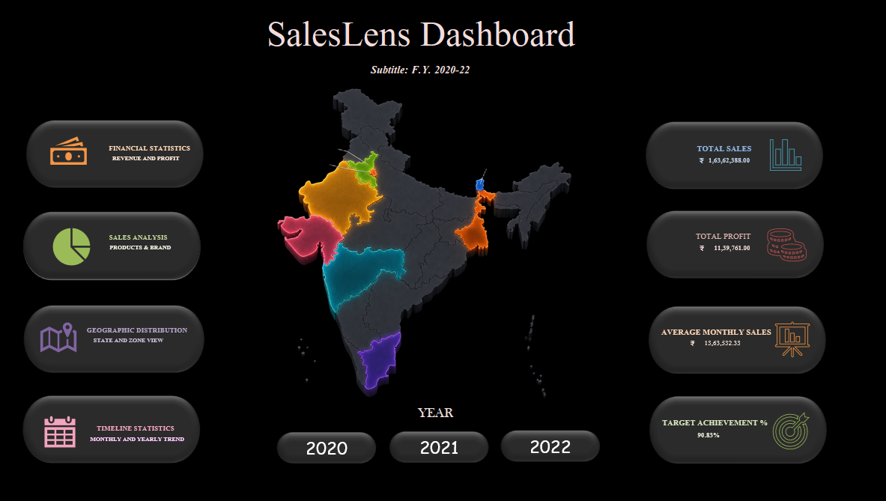
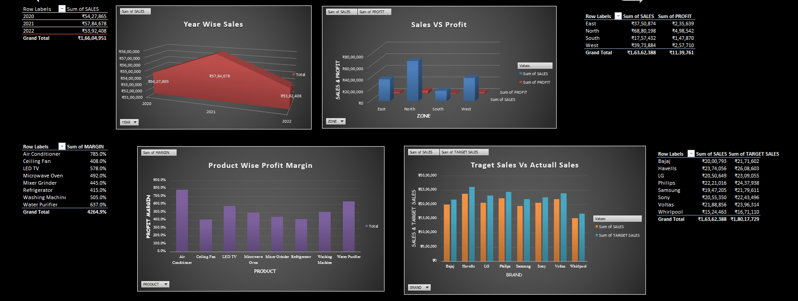
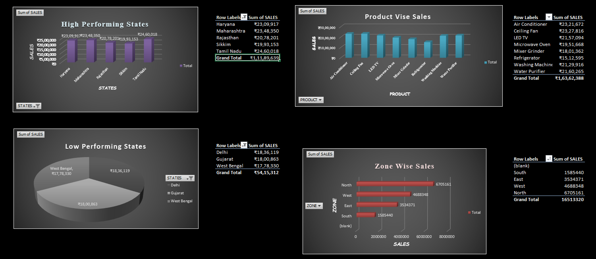
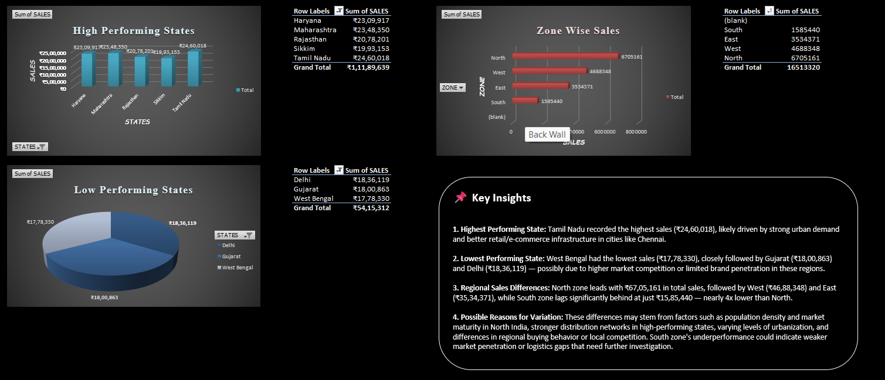
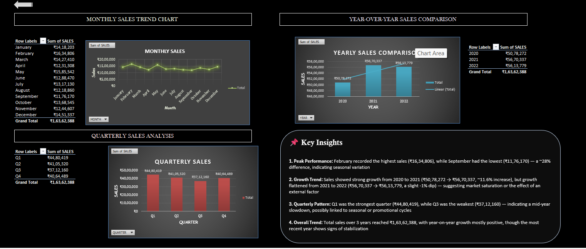

# SalesLens Dashboard 📊

An interactive, dark-themed Excel dashboard analyzing 3 years (FY 2020–22) of retail sales performance — built with pivot tables, dynamic charts, and data-driven insights across financial, product, geographic, and timeline dimensions.

---

## 🔍 Overview

SalesLens is a fully interactive sales performance dashboard built entirely in Microsoft Excel. It goes beyond static reporting — combining pivot tables, slicers, dynamic charts, and linked KPI cards to deliver a real business-intelligence experience, all within a single workbook.

The dashboard analyzes retail sales data across products, brands, states, zones, and time periods, and presents insights in a clean, professional, dark-themed UI inspired by modern BI tools.

---

## 🖼️ Preview

| Home Dashboard | Financial Statistics |
|---|---|
|  |  |

| Sales Analysis | Geographic Distribution | Timeline Statistics |
|---|---|---|
|  |  |  |

---

## ✨ Features

- **Interactive home dashboard** with clickable navigation cards linking to each analysis page
- **Live KPI cards** — Total Sales, Total Profit, Average Monthly Sales, and Target Achievement %, all linked directly to source data
- **Custom India map visualization** highlighting top-performing states by zone
- **Year selector** for filtering sales data by 2020, 2021, and 2022
- **15+ pivot-table-driven charts** covering monthly, quarterly, and yearly trends, product and brand performance, and state/zone comparisons
- **"Key Insights" summaries** on every page — translating raw numbers into business takeaways
- Consistent **dark theme with accent-colored highlights** across all pages for a polished, cohesive look

---

## 📁 Dashboard Pages

### 1. Financial Statistics
Revenue performance, profit vs. loss by zone, profit margin analysis, and target vs. actual sales comparison.

### 2. Sales Analysis
Product-wise and brand-wise sales breakdown, high vs. low performing states, and zone-wise sales distribution.

### 3. Geographic Distribution
State-wise and zone-wise sales mapping, highlighting top and bottom performing regions.

### 4. Timeline Statistics
Monthly sales trends, year-over-year comparison, and quarterly performance analysis.

---

## 🧰 Tools & Techniques Used

- Microsoft Excel (PivotTables, PivotCharts, Slicers)
- DAX-style calculated fields (Growth %, Profit Margin %, Target Achievement %)
- Cell-linked dynamic text boxes for live KPI cards
- Custom shape-based UI design (nav cards, KPI cards, insight panels)
- Conditional formatting and chart customization
- Hyperlinked navigation between sheets

---

## 📈 Key Insights

- **North zone** leads in both sales and profit, while **South zone**, despite the lowest sales volume, delivers the **highest profit margin** — indicating stronger per-unit profitability.
- **Tamil Nadu** is the top-performing state; **West Bengal** the lowest.
- Sales **peaked in 2021** before showing signs of stabilization in 2022.
- **Ceiling Fan and Air Conditioner** are the strongest-selling products; kitchen appliances lag behind.
- Overall, actual sales reached **~91% of target**, with brand-level performance varying notably.

---

## 🚀 How to Use

1. Download `SalesLens_Dashboard.xlsx`
2. Open in Microsoft Excel (2016 or later recommended for full pivot/chart compatibility)
3. Start from the **Dashboard** sheet and use the navigation cards or sheet tabs to explore each analysis page
4. Use the **Year slicer** to filter data by year where applicable

---

## 👤 Author

**Geetanjali**
Aspiring Data Analyst | Power BI • Excel • SQL • Python
[GitHub](https://github.com/Geetanjali_15) 
